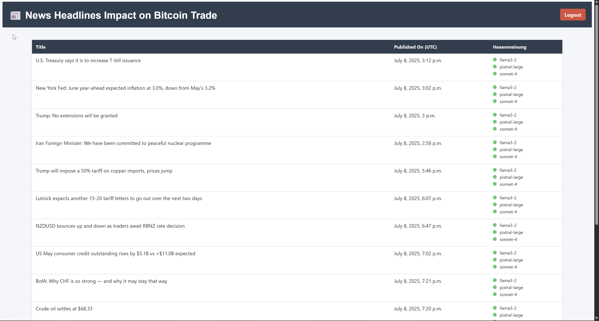

# BTC_NewsWatcher_Sentiment

Monitors Bitcoin-related news headlines, analyzes their sentiment using multiple language models, and tracks their potential market impact.

---

## ✨ Features

- Periodically fetches and analyzes news headlines from [ForexLive](https://www.forexlive.com).
- Uses multiple language models (Llama, Mistral, Sonnet) for sentiment assessment.
- Stores results in PostgreSQL for review and analysis.
- Django frontend to display and manage collected insights.
- Displays the last 24 hours of data with color indicators:
  - 🟢 **Green**: No impact on Bitcoin.
  - 🔴 **Red**: Potential impact on Bitcoin.



---

## 🧠 Prompt Used for Evaluation

Before analyzing any headline, the following prompt is sent to each model:

```

Please answer with “Yes” or “No” only. Do not provide any analysis or explanation.

Question:
Is the following statement a red flag indicating that investors should temporarily sell Bitcoin until the downtrend ends, and then buy again?

Statement:

```

---

## 🗂️ Project Structure

```

Django\_Spielplatz/
├── Market\_Sentiment/
│   ├── Database\_Engine.py            # PostgreSQL insertion logic
│   ├── Get\_Latest\_Headlines\_Forexlive.py  # Web scraping ForexLive
│   ├── Hexen\_Round\_Table.py          # Model-based sentiment voting
│   └── LLM\_Judging.py                # Amazon Bedrock LLMs
├── Weisse\_Eule/                      # Django project
│   ├── accounts/                     # User authentication
│   ├── trade\_augur/                  # Display sentiment-annotated headlines
│   └── Weisse\_Eule/                  # Django settings
├── main.py                           # Background sentiment collection
├── manage.py                         # Django CLI entry point
└── config/config.ini                 # Configuration file

````

---

## ⚙️ How It Works

1. **main.py**
   - Periodically fetches headlines.
   - Uses `HexenRoundTable` for LLM assessments.
   - Stores results in PostgreSQL.

2. **Django Frontend**
   - Displays stored headlines with sentiment verdicts.
   - Provides user login and management.

3. **Market_Sentiment**
   - Handles ingestion and analysis workflows.

---

## 🐍 Technology Stack

**Backend**
- Python 3.x
- Django
- SQLAlchemy

**Database**
- PostgreSQL (AWS RDS)

**Cloud AI**
- Amazon Bedrock (LLMs)
- Boto3 SDK

**Web Scraping**
- Requests
- BeautifulSoup

**Frontend**
- Django templates (HTML/CSS)

**Developer Tools**
- Visual Studio Code
- Python virtual environments

---

## 🛠️ Key Components

### `Database_Engine.py`
Stores results in PostgreSQL.

- `__init__`: Initializes connection parameters (configure in `config.ini`).
- `load_to_database()`: Inserts records into `trade_augur_news_headlines`.

### `Get_Latest_Headlines_Forexlive.py`
Scrapes and processes recent headlines.

- Downloads webpage.
- Extracts metadata.
- Filters by publish time.

### `Hexen_Round_Table.py`
Coordinates model opinions.

- Fetches fresh headlines.
- Sends them to all models.
- Collects Yes/No votes.

### `LLM_Judging.py`
Queries Amazon Bedrock models.

- Locates model ARNs.
- Sends prompts and retrieves answers.

---

## 🚀 Installation

Install the dependencies:

```bash
pip install Django>=4.0 sqlalchemy>=2.0 psycopg2-binary boto3 requests beautifulsoup4
````

---

## 🏁 Running the Project

**Start Django server:**

```bash
python manage.py runserver
```

**Start background sentiment collection:**

```bash
python main.py
```

**Note:** Ensure your database credentials are set in `config/config.ini`.

---

## ✍️ Author

Created by [Fady Mahrous](https://github.com/fadymahrous). Contributions are welcome!

---

## ⚠️ Disclaimer

This project is a **technical demonstration** of development, automation, and data processing skills.
It is **not intended for real-life trading or investment decisions**.
Any use of this project is entirely **at your own risk and responsibility**.
The author assumes **no liability** for any losses or damages resulting from the use of this code.

```

---